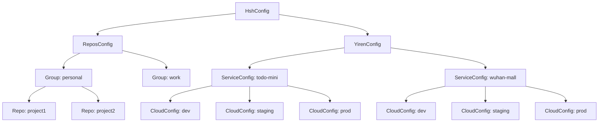

# Data Model: Cloud Login Configuration

**Generated**: 2025-10-11 | **Phase**: 1 | **Feature**: Cloud Login Command

## Overview

Data model definitions for the cloud login feature configuration structure, entity relationships, and validation rules.

## Configuration Entities

### 1. CloudConfig Entity

**Purpose**: Represents connection information for a single cloud instance environment.

**Fields**:

- `ip: string` - IP address of the cloud instance (IPv4 format)
- `privateKeyFile: string` - Absolute path to SSH private key file

**Validation Rules**:

- `ip`: Must be valid IPv4 address format (e.g., "192.168.1.10")
- `privateKeyFile`: Must be absolute path to existing file with 600 permissions

**Example**:

```typescript
{
  "ip": "192.168.1.10",
  "privateKeyFile": "/Users/username/.ssh/todo-mini-dev.pem"
}
```

### 2. ServiceConfig Entity

**Purpose**: Contains all environment configurations for a specific service.

**Fields**:

- `dev: CloudConfig` - Development environment configuration
- `staging: CloudConfig` - Staging environment configuration
- `prod: CloudConfig` - Production environment configuration

**Validation Rules**:

- All three environments (dev, staging, prod) must be present
- Each environment must contain valid CloudConfig

**Example**:

```typescript
{
  "dev": {
    "ip": "192.168.1.10",
    "privateKeyFile": "/path/to/todo-mini-dev.pem"
  },
  "staging": {
    "ip": "192.168.1.20",
    "privateKeyFile": "/path/to/todo-mini-staging.pem"
  },
  "prod": {
    "ip": "192.168.1.30",
    "privateKeyFile": "/path/to/todo-mini-prod.pem"
  }
}
```

### 3. YirenConfig Entity

**Purpose**: Contains all service configurations for cloud infrastructure.

**Fields**:

- `[serviceName: string]: ServiceConfig` - Dynamic mapping of service names to their configurations

**Validation Rules**:

- Service names must be non-empty strings
- Each service must contain valid ServiceConfig
- Minimum one service required

**Example**:

```typescript
{
  "todo-mini": { /* ServiceConfig */ },
  "wuhan-mall": { /* ServiceConfig */ }
}
```

### 4. ReposConfig Entity

**Purpose**: Contains repository path mappings for IDE integration (existing functionality).

**Fields**:

- `[groupName: string]: { [repoName: string]: string }` - Nested mapping of group and repository paths

**Validation Rules**:

- Group names must be non-empty strings
- Repository names must be non-empty strings
- Paths must be absolute directory paths

**Example**:

```typescript
{
  "personal": {
    "project1": "/Users/username/projects/project1",
    "project2": "/Users/username/projects/project2"
  },
  "work": {
    "api-service": "/Users/username/work/api-service"
  }
}
```

### 5. HshConfig Entity (Root Configuration)

**Purpose**: Root configuration structure containing all application settings.

**Fields**:

- `repos: ReposConfig` - Repository path mappings for IDE commands
- `yiren: YirenConfig` - Cloud infrastructure configurations

**Validation Rules**:

- Both `repos` and `yiren` sections must be present (can be empty objects)
- Must be valid JSON format
- File must exist at `~/.ai/config.json`

**Complete Example**:

```typescript
{
  "repos": {
    "personal": {
      "hsh-tool": "/Users/username/projects/hsh"
    }
  },
  "yiren": {
    "todo-mini": {
      "dev": {
        "ip": "192.168.1.10",
        "privateKeyFile": "/Users/username/.ssh/todo-mini-dev.pem"
      },
      "staging": {
        "ip": "192.168.1.20",
        "privateKeyFile": "/Users/username/.ssh/todo-mini-staging.pem"
      },
      "prod": {
        "ip": "192.168.1.30",
        "privateKeyFile": "/Users/username/.ssh/todo-mini-prod.pem"
      }
    },
    "wuhan-mall": {
      "dev": {
        "ip": "192.168.2.10",
        "privateKeyFile": "/Users/username/.ssh/wuhan-mall-dev.pem"
      },
      "staging": {
        "ip": "192.168.2.20",
        "privateKeyFile": "/Users/username/.ssh/wuhan-mall-staging.pem"
      },
      "prod": {
        "ip": "192.168.2.30",
        "privateKeyFile": "/Users/username/.ssh/wuhan-mall-prod.pem"
      }
    }
  }
}
```

## Entity Relationships



## State Transitions

### Configuration Migration States

1. **Legacy State**: Flat configuration structure (repos directly under root)
2. **Transition State**: Mixed configuration (some old, some new structure)
3. **Modern State**: Full nested structure with repos and yiren sections

**Migration Flow**:

```
Legacy Config → Auto-Detection → Automatic Migration → Modern Config
     ↓                ↓                    ↓               ↓
 Flat structure → Check for repos key → Wrap in repos → Full structure
```

### Connection States

1. **Disconnected**: No active SSH connection
2. **Connecting**: SSH connection in progress
3. **Connected**: SSH session established
4. **Failed**: Connection attempt failed

**Connection Flow**:

```
User Command → Parameter Validation → Config Lookup → SSH Execution → Connected/Failed
```

## Validation Rules Summary

### Configuration File Validation

- **Format**: Valid JSON syntax
- **Location**: Must exist at `~/.ai/config.json`
- **Structure**: Must contain `repos` and `yiren` objects
- **Permissions**: File must be readable by user

### Cloud Configuration Validation

- **IP Address**: Valid IPv4 format, reachable network address
- **Private Key**: File exists, has 600 permissions, valid SSH key format
- **Service Names**: Non-empty, alphanumeric with hyphens allowed
- **Environment Names**: Must be exactly "dev", "staging", or "prod"

### Runtime Validation

- **SSH Connectivity**: Network reachability, port 22 accessible
- **Authentication**: Private key matches cloud instance public key
- **User Permissions**: SSH user (root) has necessary access rights

## Error States

### Configuration Errors

- **File Not Found**: `~/.ai/config.json` does not exist
- **Invalid JSON**: Malformed JSON syntax
- **Missing Sections**: Required `repos` or `yiren` sections missing
- **Invalid Structure**: Incorrect nesting or field types

### Runtime Errors

- **Service Not Found**: Requested service not in configuration
- **Environment Not Found**: Requested environment not configured for service
- **Key File Missing**: Private key file does not exist
- **Permission Denied**: Incorrect private key file permissions
- **Connection Failed**: Network connectivity or authentication failure

### Recovery Strategies

- **Auto-Migration**: Automatically migrate legacy configuration format
- **User Prompts**: Interactive selection when parameters missing
- **Validation Warnings**: Helpful messages for fixing configuration issues
- **Graceful Fallback**: Maintain existing functionality when cloud features unavailable
